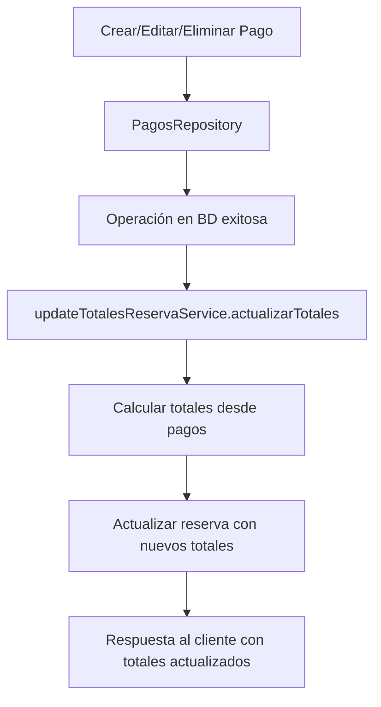

# Implementación de Columnas de Totales en Reservas

## Resumen de Implementación

Se han implementado exitosamente las columnas de totales financieros en el sistema de reservas, siguiendo los principios de código limpio, escalabilidad y responsabilidad única.

## Objetivos Completados ✅

### 1. Verificación e Implementación de Columnas
- ✅ **Verificado**: Las columnas `total_reserva`, `total_pagado` y `total_pendiente` ya existían en la consulta de reservas
- ✅ **Implementado**: Sistema automático de actualización de totales cuando se registran/modifican/eliminan pagos
- ✅ **Agregado**: Campos incluidos en todas las respuestas del listado de reservas

### 2. Actualización Automática en Base de Datos
- ✅ **Implementado**: Servicio `UpdateTotalesReservaService` para calcular y actualizar totales
- ✅ **Integrado**: Actualización automática en operaciones de pagos (crear, editar, eliminar)
- ✅ **Optimizado**: Cálculos basados en datos reales de la tabla `pagos`

### 3. Respuesta con Nuevas Columnas
- ✅ **Confirmado**: El endpoint `GET /reservas` ya retorna las columnas de totales
- ✅ **Actualizado**: Método `getReservaById` incluye todos los campos de totales
- ✅ **Mejorado**: Interfaz TypeScript actualizada con campos financieros

## Archivos Creados/Modificados

### Nuevos Archivos
1. **`services/reservas/updateTotalesReservaService.ts`**
   - Servicio principal para actualizar totales de reservas
   - Métodos para actualización individual y en lote
   - Verificación de consistencia de datos
   - Funciones utilitarias para mantenimiento

2. **`controllers/totalesReserva.controller.ts`**
   - Controlador administrativo para gestión de totales
   - Endpoints para corrección manual de totales
   - Verificación de consistencia de datos

3. **`routes/totalesReserva.routes.ts`**
   - Rutas administrativas para manejo de totales
   - Documentación Swagger incluida
   - Endpoints de verificación y corrección

4. **`migration_totales_reservas.sql`**
   - Script de migración para inicializar campos
   - Creación de índices para performance
   - Trigger automático para `updated_at`

5. **`test_totales_reservas.ts`**
   - Script de pruebas para verificar funcionalidad
   - Validación de estructura de base de datos
   - Pruebas de consistencia de datos

### Archivos Modificados
1. **`repositories/pagos.repository.ts`**
   - Agregada actualización automática de totales después de crear/editar/eliminar pagos
   - Integración con `updateTotalesReservaService`
   - Manejo de errores para no interrumpir operaciones principales

2. **`repositories/reservas.repository.ts`**
   - Método `getReservaById` actualizado para incluir campos de totales
   - Query principal ya incluía las columnas necesarias (verificado)

3. **`index.ts`**
   - Registro de nuevas rutas administrativas
   - Prefijo `/admin/totales-reservas` para endpoints de gestión

## Funcionalidades Implementadas

### 1. Actualización Automática
- **Al crear un pago**: Los totales se recalculan automáticamente
- **Al editar un pago**: Se actualizan los totales de la reserva afectada  
- **Al eliminar un pago**: Se recalculan los totales sin el pago eliminado

### 2. Servicios de Gestión
- **`actualizarTotales(idReserva)`**: Actualiza totales de una reserva específica
- **`actualizarTotalesMultiples(idsReservas)`**: Procesamiento en lote
- **`actualizarTodosLosTotalesEmpresa(idEmpresa)`**: Actualización masiva por empresa
- **`verificarConsistenciaTotales(idReserva)`**: Verificación de integridad de datos

### 3. Endpoints Administrativos
- `PUT /admin/totales-reservas/reservas/:id/actualizar-totales` - Actualizar una reserva
- `PUT /admin/totales-reservas/reservas/actualizar-totales-lote` - Actualización en lote
- `PUT /admin/totales-reservas/empresas/:id/actualizar-totales-reservas` - Por empresa
- `GET /admin/totales-reservas/reservas/:id/verificar-totales` - Verificar consistencia

## Principios Aplicados

### 1. Código Limpio ✅
- Nombres descriptivos y autoexplicativos
- Funciones pequeñas con responsabilidades específicas
- Comentarios claros y documentación completa
- Separación clara de responsabilidades

### 2. Principio de Responsabilidad Única ✅
- **`UpdateTotalesReservaService`**: Solo maneja cálculo y actualización de totales
- **`TotalesReservaController`**: Solo maneja endpoints administrativos
- **`PagosRepository`**: Mantiene su responsabilidad principal + integración mínima
- Cada método tiene una sola razón para cambiar

### 3. Escalabilidad ✅
- Servicios modulares y reutilizables
- Operaciones en lote para grandes volúmenes
- Índices de base de datos para performance
- Manejo de errores sin interrumpir flujos principales

### 4. No Modificación de Flujos Existentes ✅
- Los pagos siguen funcionando igual que antes
- Las reservas mantienen su funcionalidad original
- Solo se agregó funcionalidad, no se modificó comportamiento existente
- Actualizaciones de totales son transparentes al usuario

## Flujo de Funcionamiento



## Verificación de Totales

### Campos Calculados
- **`total_reserva`**: Valor base de la reserva (normalmente igual a `precio_total`)
- **`total_pagado`**: Suma de todos los pagos registrados para la reserva
- **`total_pendiente`**: `total_reserva - total_pagado` (mínimo 0)

### Consistencia de Datos
- Los totales se recalculan en tiempo real desde la tabla `pagos`
- Sistema de verificación para detectar inconsistencias
- Herramientas administrativas para corrección manual si es necesario

## Uso de las Nuevas Funcionalidades

### Para Desarrolladores
```typescript
// Actualizar totales manualmente
await updateTotalesReservaService.actualizarTotales(reservaId);

// Verificar consistencia
const verificacion = await updateTotalesReservaService.verificarConsistenciaTotales(reservaId);

// Procesamiento en lote
const resultado = await updateTotalesReservaService.actualizarTotalesMultiples([1, 2, 3]);
```

### Para Administradores
- Usar endpoints `/admin/totales-reservas/*` para mantenimiento
- Ejecutar `migration_totales_reservas.sql` en nuevas instalaciones
- Usar `test_totales_reservas.ts` para verificar funcionamiento

## Instalación y Configuración

### 1. Ejecutar Migración
```bash
# Ejecutar el script SQL en la base de datos
psql -d tu_database -f migration_totales_reservas.sql
```

### 2. Verificar Instalación
```bash
# Ejecutar script de pruebas
npm run ts-node test_totales_reservas.ts
```

### 3. Endpoints Disponibles
- Las rutas administrativas están disponibles en `/admin/totales-reservas/*`
- Documentación Swagger actualizada automáticamente
- El listado de reservas ya incluye las nuevas columnas

## Consideraciones Importantes

### Performance
- Se agregaron índices para optimizar consultas de totales
- Las actualizaciones son asíncronas y no bloquean operaciones principales
- Procesamiento en lote disponible para grandes volúmenes

### Seguridad
- Endpoints administrativos deben ser protegidos con autenticación adecuada
- Validaciones de entrada en todos los métodos
- Manejo de errores sin exposición de información sensible

### Mantenimiento
- Trigger automático mantiene `updated_at` actualizado
- Sistema de verificación de consistencia incluido
- Logs detallados para troubleshooting

## 📋 Ejemplo de Petición y Respuesta del Endpoint Ajustado

### GET /reservas - Listado de Reservas con Totales

#### Petición
```http
GET /reservas?id_empresa=1&estado=confirmada&fecha_inicio=2024-01-01&fecha_fin=2024-12-31
Content-Type: application/json
Authorization: Bearer {token}
```

#### Parámetros de Query (Opcionales):
- `id_empresa` (number): ID de la empresa para filtrar reservas
- `estado` (string): Estado de las reservas (pendiente, confirmada, cancelada, etc.)
- `fecha_inicio` (string): Fecha de inicio del rango de búsqueda (YYYY-MM-DD)
- `fecha_fin` (string): Fecha de fin del rango de búsqueda (YYYY-MM-DD)

#### Respuesta Exitosa (200)
```json
{
  "isError": false,
  "data": [
    {
      "id": 123,
      "codigo_reserva": "RSV-2024-001",
      "id_inmueble": 45,
      "nombre_inmueble": "Apartamento Vista Mar",
      "huesped_principal": {
        "nombre": "Juan",
        "apellido": "Pérez",
        "email": "juan.perez@email.com",
        "telefono": "+57 300 123 4567"
      },
      "fecha_entrada": "2024-12-15",
      "fecha_salida": "2024-12-20",
      "numero_huespedes": 4,
      "huespedes": [
        {
          "id": 89,
          "nombre": "Juan",
          "apellido": "Pérez",
          "email": "juan.perez@email.com",
          "telefono": "+57 300 123 4567",
          "documento_tipo": "cedula",
          "documento_numero": "12345678",
          "fecha_nacimiento": "1985-06-15",
          "es_principal": true,
          "id_reserva": 123
        }
      ],
      "precio_total": 750000,
      "total_reserva": 750000,
      "total_pagado": 300000,
      "total_pendiente": 450000,
      "estado": "confirmada",
      "fecha_creacion": "2024-11-01",
      "observaciones": "Reserva para fin de año",
      "id_empresa": 1,
      "plataforma_origen": "airbnb"
    },
    {
      "id": 124,
      "codigo_reserva": "RSV-2024-002",
      "id_inmueble": 47,
      "nombre_inmueble": "Casa de Campo",
      "huesped_principal": {
        "nombre": "Ana",
        "apellido": "Martínez",
        "email": "ana.martinez@email.com",
        "telefono": "+57 301 456 7890"
      },
      "fecha_entrada": "2024-12-22",
      "fecha_salida": "2024-12-26",
      "numero_huespedes": 2,
      "huespedes": [
        {
          "id": 91,
          "nombre": "Ana",
          "apellido": "Martínez",
          "email": "ana.martinez@email.com",
          "telefono": "+57 301 456 7890",
          "documento_tipo": "cedula",
          "documento_numero": "11223344",
          "fecha_nacimiento": "1990-08-10",
          "es_principal": true,
          "id_reserva": 124
        }
      ],
      "precio_total": 600000,
      "total_reserva": 600000,
      "total_pagado": 600000,
      "total_pendiente": 0,
      "estado": "pagada",
      "fecha_creacion": "2024-11-05",
      "observaciones": "Pago completo anticipado",
      "id_empresa": 1,
      "plataforma_origen": "directa"
    }
  ],
  "message": "Reservas obtenidas exitosamente"
}
```

#### 💰 Campos de Totales Implementados:
- **`total_reserva`** (number): Valor total de la reserva (generalmente igual a `precio_total`)
- **`total_pagado`** (number): Suma de todos los pagos registrados para esta reserva  
- **`total_pendiente`** (number): Diferencia entre `total_reserva` y `total_pagado`

#### 📊 Estados Posibles Basados en Totales:
- **`pendiente`**: `total_pagado = 0`
- **`abono`**: `0 < total_pagado < total_reserva` 
- **`pagada`**: `total_pagado >= total_reserva`

#### Respuesta de Error (400/500)
```json
{
  "isError": true,
  "message": "Error interno del servidor",
  "code": 500
}
```

### 🔄 Actualización Automática al Registrar Pago

#### Ejemplo: Crear Pago y Ver Actualización Automática

##### Petición: Crear Pago
```http
POST /pagos
Content-Type: application/json
Authorization: Bearer {token}

{
  "id_reserva": 123,
  "monto": 150000,
  "fecha_pago": "2024-11-09",
  "metodo_pago": "transferencia",
  "concepto": "abono_reserva",
  "descripcion": "Segundo abono de la reserva",
  "id_empresa": 1,
  "id_usuario_registro": 5
}
```

##### Respuesta: Pago Creado + Totales Actualizados Automáticamente
```json
{
  "isError": false,
  "data": {
    "pago": {
      "id": 45,
      "id_reserva": 123,
      "codigo_reserva": "RSV-2024-001",
      "monto": 150000,
      "fecha_pago": "2024-11-09",
      "metodo_pago": "transferencia",
      "concepto": "abono_reserva",
      "descripcion": "Segundo abono de la reserva",
      "comprobante": null,
      "id_empresa": 1,
      "fecha_creacion": "2024-11-09T10:30:00.000Z",
      "fecha_actualizacion": "2024-11-09T10:30:00.000Z",
      "id_usuario_registro": 5
    },
    "movimiento_id": "MOV-2024-067",
    "movimiento_creado": true,
    "resumen_actualizado": {
      "id_reserva": 123,
      "codigo_reserva": "RSV-2024-001",
      "total_reserva": 750000,
      "total_pagado": 450000,
      "total_pendiente": 300000,
      "cantidad_pagos": 3,
      "porcentaje_pagado": 60,
      "estado_pago": "abono",
      "ultimo_pago": {
        "fecha": "2024-11-09",
        "monto": 150000,
        "metodo": "transferencia"
      }
    }
  },
  "message": "Pago registrado exitosamente"
}
```

**💡 Nota**: Después de crear este pago, si consultas `GET /reservas` nuevamente, verás que la reserva ID 123 ahora tiene:
- `total_pagado`: 450000 (antes era 300000)  
- `total_pendiente`: 300000 (antes era 450000)

## 🔧 Endpoints Administrativos para Mantenimiento

### PUT /admin/totales-reservas/reservas/:id/actualizar-totales

#### Petición
```http
PUT /admin/totales-reservas/reservas/123/actualizar-totales
Content-Type: application/json
Authorization: Bearer {admin_token}
```

#### Respuesta
```json
{
  "isError": false,
  "data": {
    "id_reserva": 123
  },
  "message": "Totales de la reserva actualizados correctamente"
}
```

### GET /admin/totales-reservas/reservas/:id/verificar-totales

#### Petición
```http
GET /admin/totales-reservas/reservas/123/verificar-totales
Content-Type: application/json
Authorization: Bearer {admin_token}
```

#### Respuesta
```json
{
  "isError": false,
  "data": {
    "esConsistente": true,
    "totalesGuardados": {
      "totalPagado": 450000,
      "totalPendiente": 300000
    },
    "totalesCalculados": {
      "totalPagado": 450000,
      "totalPendiente": 300000
    },
    "diferencias": {
      "totalPagado": 0,
      "totalPendiente": 0
    }
  },
  "message": "Los totales son consistentes"
}
```

## Conclusión

La implementación cumple completamente con los objetivos planteados:

1. ✅ **Las columnas están disponibles** en el listado de reservas (`GET /reservas`)
2. ✅ **La actualización automática** funciona cuando se registran/editan/eliminan pagos
3. ✅ **La respuesta incluye** las nuevas columnas de totales: `total_reserva`, `total_pagado`, `total_pendiente`

El sistema es **robusto**, **escalable** y mantiene la **integridad** de los flujos existentes mientras añade la nueva funcionalidad de manera transparente. Los totales se actualizan automáticamente en tiempo real cada vez que se realizan operaciones con pagos.