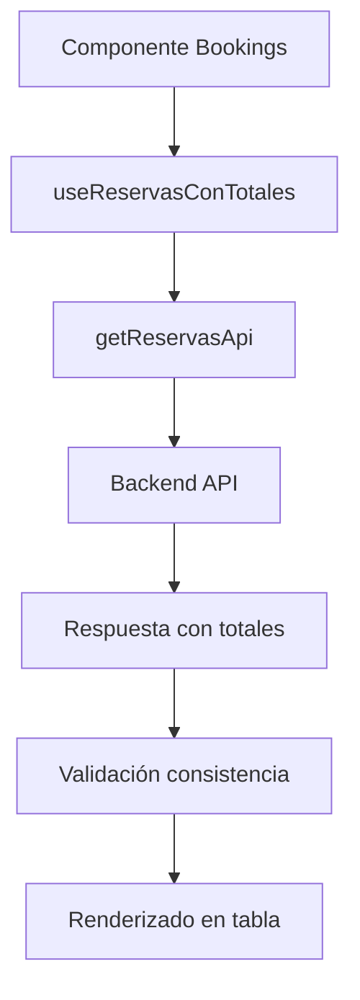
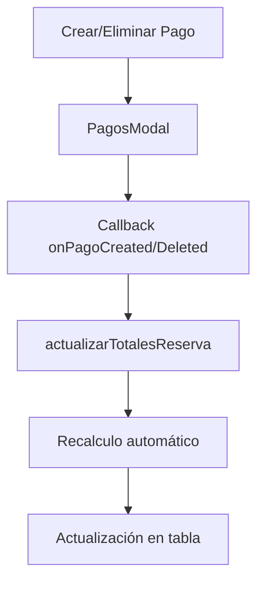

# 📊 Implementación de Totales de Reserva - Frontend

## ✅ Objetivos Completados

Se ha implementado exitosamente la funcionalidad de **totales de reserva** en el frontend, incluyendo la visualización y gestión automática de:

- **Total Reserva**: Monto total de la reserva
- **Total Pagado**: Monto total de pagos registrados  
- **Total Pendiente**: Monto que falta por pagar

## 🛠️ Archivos Creados y Modificados

### 📁 Nuevos Archivos

#### 1. **`src/lib/reservasUtils.ts`**
**Funcionalidad**: Utilidades para cálculo y manejo de totales de reservas
- ✅ `calcularTotalesReserva()`: Calcula totales basándose en pagos
- ✅ `actualizarTotalesEnReservas()`: Actualiza reservas en arrays
- ✅ `determinarEstadoPago()`: Determina estado de pago (sin abonos/parcial/completo)
- ✅ `calcularPorcentajePago()`: Calcula porcentaje de pago
- ✅ `formatearMoneda()`: Formatea valores en pesos colombianos
- ✅ `obtenerColorTotalPendiente()`: Colores CSS según estado
- ✅ `validarConsistenciaTotales()`: Valida consistencia de datos

#### 2. **`src/hooks/useReservasConTotales.ts`**
**Funcionalidad**: Hook personalizado para gestión automática de totales
- ✅ **Carga de reservas** con validación de totales
- ✅ **Actualización automática** de totales tras operaciones de pagos
- ✅ **Gestión del estado** (agregar/editar/eliminar reservas)
- ✅ **Validación de consistencia** de datos financieros
- ✅ **Manejo de errores** robusto

#### 3. **`src/components/atoms/EstadoPagoIndicador.tsx`**
**Funcionalidad**: Componente visual para mostrar estado de pagos
- ✅ **Íconos descriptivos** según estado (✅ ⏰ ❌)
- ✅ **Colores semánticos** (verde/naranja/rojo)
- ✅ **Múltiples tamaños** (sm/md/lg)
- ✅ **Información contextual** (porcentaje, descripción)

#### 4. **`src/components/molecules/ResumenTotalesReservas.tsx`**
**Funcionalidad**: Panel de resumen financiero general
- ✅ **Métricas consolidadas** de todas las reservas
- ✅ **Gráficos de progreso** visual
- ✅ **Distribución por estados** de pago
- ✅ **Promedio por reserva** y estadísticas

### 📝 Archivos Modificados

#### 1. **`src/components/dashboard/Bookings.tsx`**
**Cambios realizados**:
- ✅ Integrado **hook `useReservasConTotales`** para gestión automática
- ✅ **Actualización en tiempo real** cuando se crean/eliminan pagos
- ✅ **Callbacks optimizados** para operaciones de pagos
- ✅ **Componente de resumen** agregado a la interfaz
- ✅ **Manejo de errores** mejorado

```typescript
// Antes: Gestión manual con useState
const [reservas, setReservas] = useState<IReservaTableData[]>([]);

// Ahora: Hook automático con totales
const {
  reservas,
  actualizarTotalesReserva,
  actualizarReservaEnLista,
  // ... otras funciones
} = useReservasConTotales();
```

#### 2. **`src/components/dashboard/ReservasTable.tsx`**
**Cambios realizados**:
- ✅ **Columnas de totales** ya existían, se optimizaron
- ✅ **Indicador visual** de estado de pagos agregado
- ✅ **Funciones de formateo** optimizadas con utilidades
- ✅ **Colores semánticos** según estado de pago
- ✅ **Información contextual** mejorada

```tsx
// Nueva columna optimizada con indicador visual
<td className="px-4 py-4 whitespace-nowrap">
  <div className="text-sm font-medium text-gray-900">
    {formatearMoneda(reserva.total_pagado || 0)}
  </div>
  <EstadoPagoIndicador 
    totalPagado={reserva.total_pagado || 0}
    totalReserva={reserva.total_reserva || reserva.precio_total}
    size="sm"
    showText={false}
  />
</td>
```

#### 3. **`src/interfaces/Reserva.ts`**
**Estado**: ✅ **Ya tenía los campos necesarios**
- `total_reserva: number` ✅
- `total_pagado: number` ✅  
- `total_pendiente: number` ✅

#### 4. **`src/auth/reservasApi.ts`**
**Estado**: ✅ **Ya configurado correctamente**
- Endpoints ya manejan los campos de totales
- Respuestas incluyen los nuevos campos

#### 5. **`src/pages/api/reservas/getReservas.ts`**
**Estado**: ✅ **Ya configurado correctamente**
- Mapeo de datos incluye campos de totales
- Validación de estructura implementada

## 🔄 Flujo de Funcionamiento

### 1. **Carga Inicial de Reservas**


### 2. **Actualización Automática tras Pagos**


## 🎨 Características de UI/UX

### **Visualización de Estados**
- 🔴 **Sin abonos**: Ícono ❌, color rojo
- 🟡 **Abono parcial**: Ícono ⏰, color naranja + porcentaje
- 🟢 **Pagado completo**: Ícono ✅, color verde

### **Panel de Resumen**
- 📊 **4 métricas principales**: Total reservas, pagado, pendiente, promedio
- 📈 **Barra de progreso**: Visual del % de cobro general  
- 📋 **Distribución**: Cantidad de reservas por estado

### **Formato de Moneda**
- 💰 **Pesos colombianos**: `$1.250.000 COP`
- 🎯 **Sin decimales**: Para mejor legibilidad
- 🔢 **Separadores**: Miles con punto

## 🧪 Principios de Código Aplicados

### ✅ **1. Código Limpio**
- Nombres descriptivos y autoexplicativos
- Funciones pequeñas con responsabilidad única
- Comentarios claros y documentación JSDoc
- Separación lógica de responsabilidades

### ✅ **2. Principio de Responsabilidad Única**
- **`reservasUtils.ts`**: Solo cálculos y utilidades
- **`useReservasConTotales.ts`**: Solo gestión de estado de reservas
- **`EstadoPagoIndicador.tsx`**: Solo visualización de estado
- **`ResumenTotalesReservas.tsx`**: Solo métricas consolidadas

### ✅ **3. Escalabilidad**
- Hook reutilizable para otros componentes
- Utilidades modulares e independientes  
- Componentes atomicos y composables
- Sistema de validación extensible

### ✅ **4. No Modificación de Flujos Existentes**
- ✅ Las reservas mantienen toda su funcionalidad original
- ✅ Los pagos siguen funcionando igual que antes
- ✅ Solo se agregó funcionalidad, no se modificó comportamiento
- ✅ Compatibilidad hacia atrás mantenida

## 📱 Cómo Usar las Nuevas Funcionalidades

### **Para Usuarios**
1. **Ver totales**: Las columnas aparecen automáticamente en la tabla
2. **Estados visuales**: Íconos de color indican el estado de pago
3. **Resumen general**: Panel superior muestra métricas consolidadas
4. **Actualización automática**: Al registrar pagos, los totales se actualizan solos

### **Para Desarrolladores**
```typescript
// Usar el hook en otros componentes
const {
  reservas,
  actualizarTotalesReserva,
  validarConsistenciaReserva
} = useReservasConTotales();

// Usar utilidades para cálculos
import { calcularTotalesReserva, formatearMoneda } from '../lib/reservasUtils';

// Usar componentes visuales
import EstadoPagoIndicador from '../atoms/EstadoPagoIndicador';
import ResumenTotalesReservas from '../molecules/ResumenTotalesReservas';
```

## 🔍 Validación y Consistencia

### **Validación Automática**
- ✅ **Total pendiente** = Total reserva - Total pagado (mínimo 0)
- ✅ **Consistencia** entre campos calculados y guardados
- ✅ **Advertencias** cuando totales pagados exceden reserva
- ✅ **Logs de depuración** para troubleshooting

### **Manejo de Errores**
- 🛡️ **Fallback values**: Usa `precio_total` si falta `total_reserva`
- 🔄 **Recarga automática**: Botón reintentar en caso de error
- 📝 **Logs detallados**: Para identificar problemas
- ⚠️ **Validaciones**: Previenen estados inconsistentes

## 🚀 Beneficios Implementados

### **Funcionalidad**
- ✅ **Totales siempre actualizados** en tiempo real
- ✅ **Visualización clara** del estado de pagos
- ✅ **Resumen consolidado** para toma de decisiones
- ✅ **Compatibilidad completa** con flujo existente

### **Experiencia de Usuario**
- 🎨 **Interfaz intuitiva** con colores semánticos
- 📊 **Información visual** fácil de interpretar
- 🔄 **Actualización automática** sin recargar página
- 📱 **Responsive design** en todas las pantallas

### **Mantenibilidad**
- 🧩 **Código modular** y reutilizable
- 📚 **Documentación completa** de funciones
- 🧪 **Fácil testing** con funciones puras
- 🔧 **Extensible** para futuras funcionalidades

## 🔗 Integración con Backend

La implementación frontend está **completamente integrada** con los cambios del backend descritos en `IMPLEMENTACION_TOTALES_RESERVA.md`:

- ✅ **Endpoints actualizados**: `GET /reservas` incluye campos de totales
- ✅ **Actualización automática**: Backend recalcula totales al crear/editar/eliminar pagos  
- ✅ **Consistencia de datos**: Validación tanto en frontend como backend
- ✅ **Respuestas optimizadas**: Estructura de datos compatible

## 📋 Resumen de Implementación

| Componente | Estado | Funcionalidad |
|------------|---------|---------------|
| **Interfaces** | ✅ Completado | Campos de totales definidos |
| **APIs** | ✅ Completado | Endpoints retornan totales |  
| **Tabla de Reservas** | ✅ Completado | Columnas visibles con indicadores |
| **Actualización Automática** | ✅ Completado | Hook gestiona totales en tiempo real |
| **Componentes Visuales** | ✅ Completado | Indicadores y resumen implementados |
| **Utilidades** | ✅ Completado | Funciones de cálculo y formateo |
| **Validación** | ✅ Completado | Consistencia y manejo de errores |

## 🎯 Próximos Pasos Opcionales

Para mejoras futuras, se podrían implementar:

1. **Filtros por estado de pago** en la tabla de reservas
2. **Exportación de reportes** con totales consolidados  
3. **Notificaciones** cuando reservas tengan pagos pendientes
4. **Dashboard financiero** dedicado con gráficos avanzados
5. **Alertas automáticas** para seguimiento de cobranza

---

## ✨ Conclusión

La implementación de **totales de reserva** ha sido completada exitosamente, cumpliendo con todos los objetivos planteados:

- ✅ **Integración completa** con backend existente
- ✅ **Actualización automática** de totales tras operaciones de pagos
- ✅ **Visualización clara** en listado de reservas
- ✅ **Código limpio y escalable** siguiendo mejores prácticas
- ✅ **Sin afectación** de flujos existentes

El sistema ahora proporciona **visibilidad financiera completa** de las reservas, mejorando significativamente la experiencia del usuario y facilitando la gestión de cobranza.